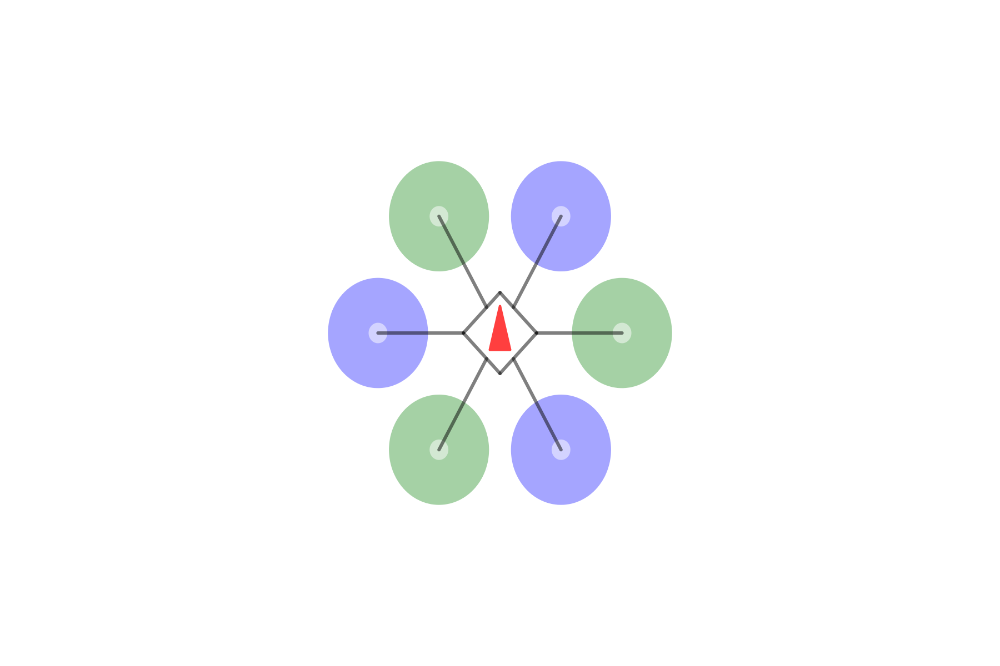

# FSimPlots
[FSimPlots.jl](https://github.com/JinraeKim/FSimPlots.jl) is
the plotting package for predefined environments exported from [FlightSims.jl](https://github.com/JinraeKim/FlightSims.jl).

FSimPlots.jl is detached from FlightSims.jl to improve the precompilation overload.
See [FSimBase.jl](https://github.com/JinraeKim/FSimBase.jl) for the lightweight version of FlightSims.jl.

# Examples
## Multicopters
See `src/multicopters.jl`.

You can find the following examples from `test/plots.jl`.
### Animation

### Top-view image

### Reference frame and hexacopter

### Problem description for hexacopter control

