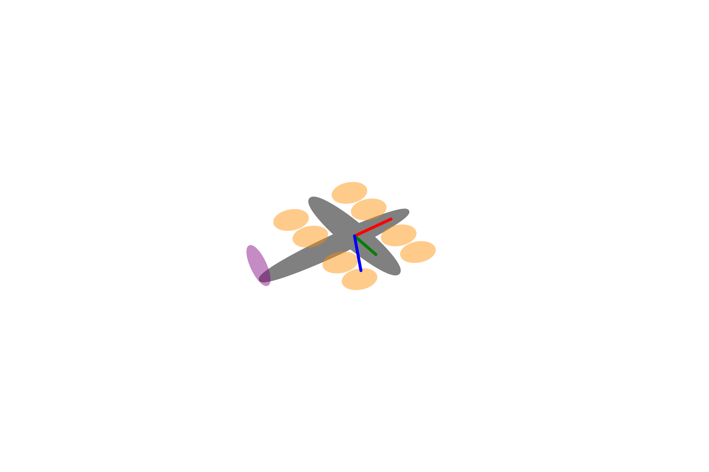
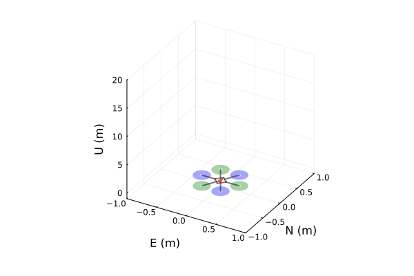
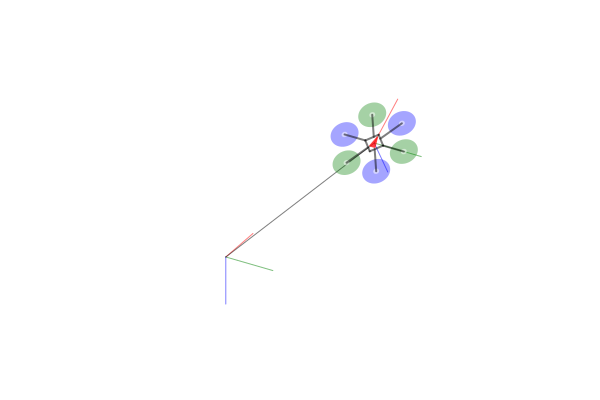

# FSimPlots
[FSimPlots.jl](https://github.com/JinraeKim/FSimPlots.jl) is
the plotting package for predefined environments exported from [FlightSims.jl](https://github.com/JinraeKim/FlightSims.jl).

FSimPlots.jl is detached from FlightSims.jl to improve the precompilation overload.
See [FSimBase.jl](https://github.com/JinraeKim/FSimBase.jl) for the lightweight version of FlightSims.jl.

# Examples
## VTOL (Vertical Take-off and Landing vehicles)
See `src/vtols.jl`.
#### Lift+Cruise VTOL

## Multicopters
See `src/multicopters.jl`.

You can find the following examples from the directory `./test`.
### Animation

### Top-view image
#### Quad

#### Hexa

### Reference frame and hexacopter

### Problem description for hexacopter control

### Multicopters
#### Quad

#### Hexa

## Used in other projects
- [JinraeKim/VTOLSmoothTransitionFlight (SciTech 2025)](https://github.com/JinraeKim/VTOLSmoothTransitionFlight)
- [JinraeKim/KSAS2021Fall](https://github.com/JinraeKim/KSAS2021Fall)
